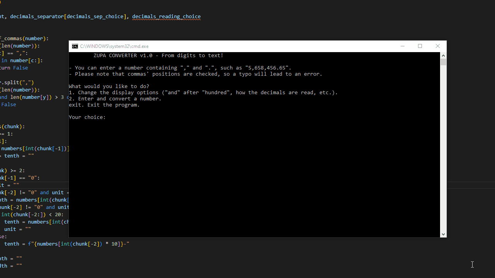

*last updated on June 7, 2024 - Python 3.10.2*

# ZUPA CONVERTER v1.0 - From digits to text!
Did you know that numbers can be written in letters? That's right! And to save you time because no one wants to go back to primary school, I made a script that does the job for you!

What the program does for you (for free, again...):
- Allows you to input numbers with or without commas (45,021 or 45021)
- Allows use to use decimals (46.0032)
- Checks if you made a typo (bad comma position: 45,6548,84.12 / too many periods: 5,684.21.23)
- Allows you to output "and" after "hundred" (English way) or without (American way)
- Allows infinite numbers, provided you add more units ("million", "billion" etc.) by editing the script. The opposite is also true: you can limit the input by removing the units from the list. Right now it's up to 999 decillion. I based that from the current balance on my bank account.

What the program does not do for you:
- Negative numbers (because you know, you just need to add "-", pronounced "minus", so...)
- Tell you where your typo is (it does a little because I'm generous)
- Your morning coffee
- And much, much more

# Preview

# Pre-requisites
- Python (3.10.2+)
- A number
- The *.bat file is to quickly launch the script on Windows.

Any bugs? Of course there are. Have you seen there size in Australia? Geezus!

# Updates (date = commit date)
*June 12,2024*
- Added menus
- Display options menu where the user can choose how the result will be displayed
- In the options menu: choose to display (or not) "and" after "hundred"
- In the options menu: how the decimals separator (".") is read ("point" or "and")
- In the options menu: choose how the decimals are read (one by one as digits or as a whole number)
